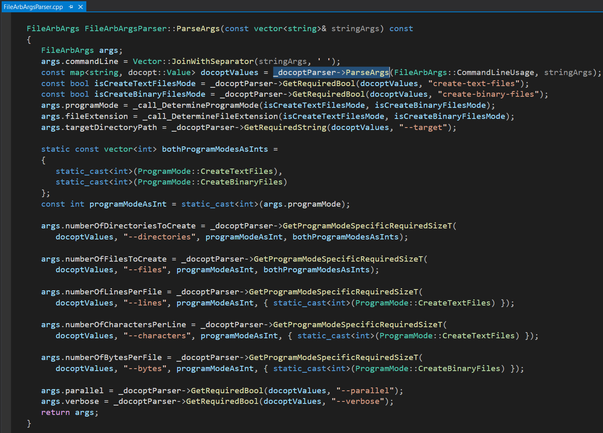
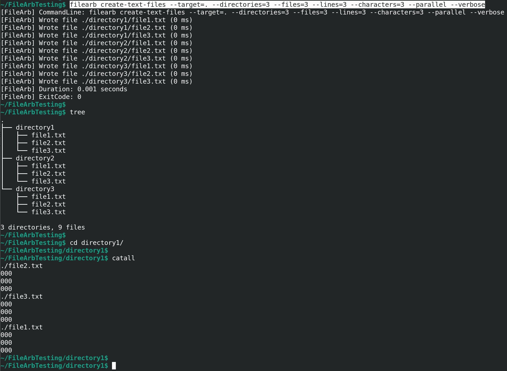
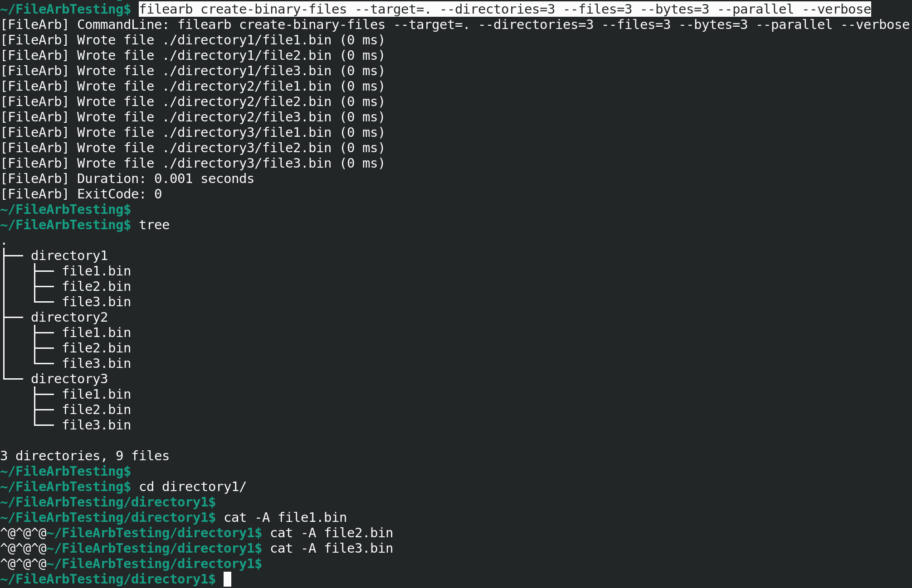
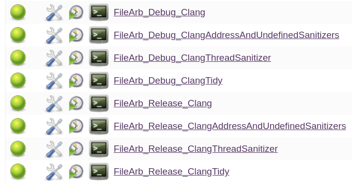
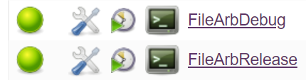

# FileArb 🗃️

[](https://en.wikipedia.org/wiki/C%2B%2B20)  

FileArb is a C++ command line program for quickly creating in parallel an arbitrary number of text files or binary files for performance testing FileRevisor and file systems in general.

|Build Type|Build Status|
|----------|------------|
|Travis CI Linux Clang 9.0.1, Linux GCC 9.3.0, and macOS AppleClang 12.0.0 Debug and Release|[](https://travis-ci.com/NeilJustice/FileArb)|
|AppVeyor Windows (Visual Studio 2019 x64)|<a href="https://ci.appveyor.com/project/NeilJustice/FileArb"></a>|
|Code Coverage For The Travis CI Linux GCC 9.3.0 Release Build|[](https://codecov.io/gh/NeilJustice/FileArb)|

FileArb is rigorously unit tested with <a href="https://github.com/NeilJustice/ZenUnitAndMetalMock">ZenUnit and MetalMock</a>.

* [FileArb Command Line Usage](#filearb-command-line-usage)
* [FileArb Program Modes](#filearb-program-modes)
   * [create-text-files](#create-text-files)
   * [create-binary-files](#create-binary-files)
* [Linux Jenkins Jobs Which Compile, clang-tidy, AddressSanitize, UndefinedBehaviorSanitize, and ThreadSanitize FileArb](#linux-jenkins-jobs-which-compile-clang-tidy-addresssanitize-undefinedbehaviorsanitize-and-threadsanitize-filearb)
* [Windows Jenkins Jobs Which Compile FileArb](#windows-jenkins-jobs-which-compile-filearb)
* [Four Steps To Compile And Install FileArb On Linux](#four-steps-to-compile-and-install-filearb-on-linux)
* [Four Steps To Compile And Install FileArb On Windows](#four-steps-to-compile-and-install-filearb-on-windows)

## FileArb Command Line Usage

```
FileArb v0.9.0
Creates an arbitrary number of text or binary files
containing an arbitrary number of lines, characters, or bytes
for performance testing FileRevisor or file systems in general.
https://github.com/NeilJustice/FileArb

Usage:
   filearb create-text-files
      --target=<TargetDirectoryPath>
      --directories=<NumberOfDirectories>
      --files=<FilesPerDirectory>
      --lines=<LinesPerFile>
      --characters=<CharactersPerLine>
      [--parallel]
      [--verbose]
   filearb create-binary-files
      --target=<TargetDirectoryPath>
      --directories=<NumberOfDirectories>
      --files=<NumberOfFiles>
      --bytes=<BytesPerFile>
      [--parallel]
      [--verbose]
```

FileArb command line arguments are parsed using the excellent single-header library [docopt.cpp](https://github.com/docopt/docopt.cpp):



## FileArb Program Modes

### create-text-files

FileArb program mode `create-text-files` creates at a specified directory a specified number of subdirectories containing a specified number of text files each containing '0' characters.



### create-binary-files

FileArb program mode `create-binary-files` creates at a specified directory a specified number of subdirectories containing a specified number of binary files each containing binary 0 bytes.



## Linux Jenkins Jobs Which Compile, clang-tidy, AddressSanitize, UndefinedBehaviorSanitize, and ThreadSanitize FileArb

A Jenkins Blue Ocean build pipeline builds the following FileArb Jenkins jobs on Fedora 31:



## Windows Jenkins Jobs Which Compile FileArb

A Jenkins Blue Ocean build pipeline builds the following FileArb Jenkins jobs on Windows:



## Four Steps To Compile And Install FileArb On Linux

```
git clone https://github.com/NeilJustice/FileArb
cd FileArb && mkdir Release && cd Release
CXX=clang++ cmake .. -GNinja -DCMAKE_BUILD_TYPE=Release
sudo cmake --build . --target install # Compiles then copies binary 'filearb' to /usr/local/bin/filearb
```

## Four Steps To Compile And Install FileArb On Windows

```
git clone https://github.com/NeilJustice/FileArb
cd FileArb
cmake . -G"Visual Studio 16 2019" -A x64 -DCMAKE_INSTALL_PREFIX=C:\bin
cmake --build . --config Release --target install # Builds then copies FileArb.exe to C:\bin\FileArb.exe
```
