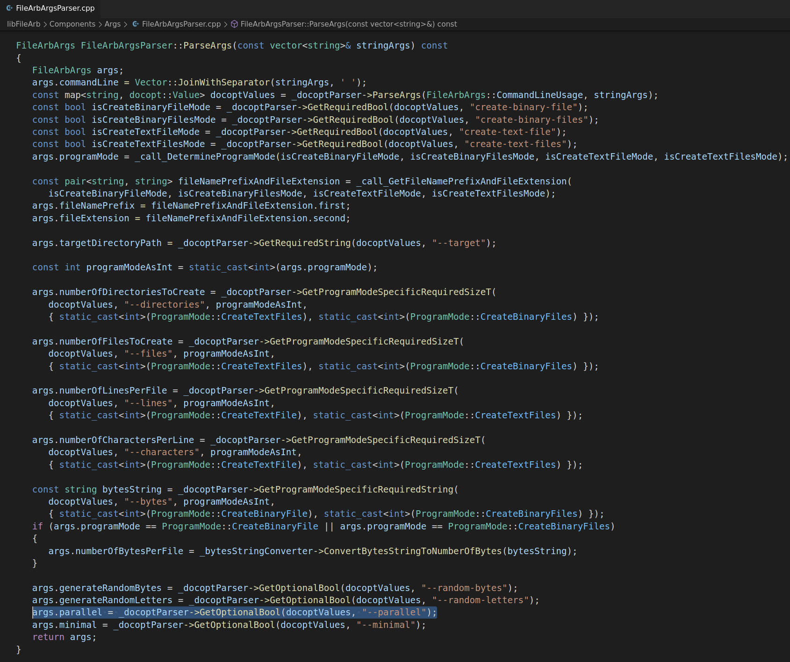
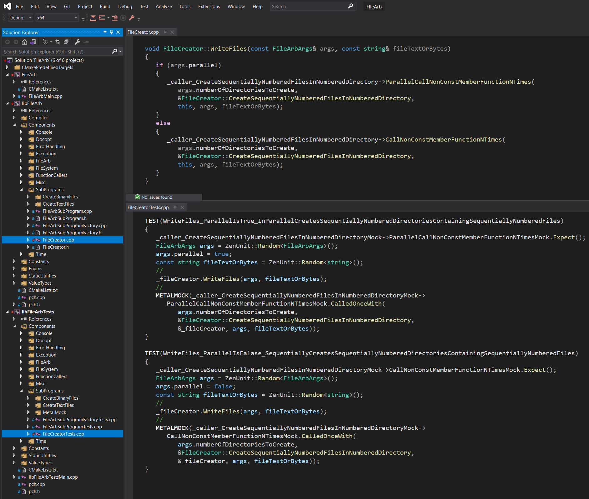
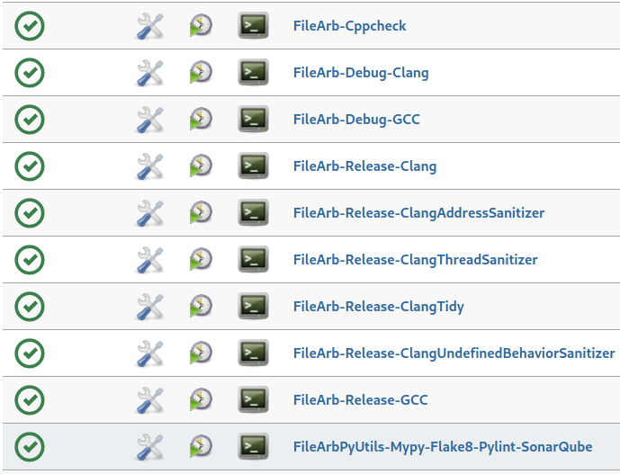
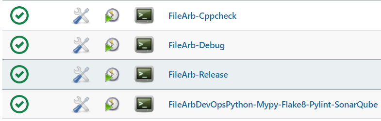

# 🗃️ FileArb 🗃️

[](https://en.wikipedia.org/wiki/C%2B%2B20)  

FileArb is a cross-platform C++ command line program for quickly creating in parallel a configurable number of text files or binary files containing a configurable number of characters or bytes.

FileArb can be used for performance testing file-I/O-intensive programs such as <a href="https://github.com/NeilJustice/FileRevisor">FileRevisor</a> and for performance testing the write speed of storage hardware such as USB drives, NVMe drives, and network file shares.

|Build Type|Build Status|
|----------|------------|
|GitHub Actions Debug and Release build - ubuntu-latest Clang 10.0.0 / GCC 10.2.0|[](https://github.com/NeilJustice/FileArb/actions/workflows/build.yml)|
|AppVeyor Debug and Release build - Visual Studio 2019 x64|<a href="https://ci.appveyor.com/project/NeilJustice/FileArb"></a>|
|Codecov.io code coverage for FileArb's C++ and FileArbDevOpsPython|[](https://codecov.io/gh/NeilJustice/FileArb)|
|SonarCloud scan of FileArbDevOpsPython - the Python code which build and tests FileArb|[](https://sonarcloud.io/dashboard?id=NeilJustice_FileArb)|

FileArb is rigorously unit tested with <a href="https://github.com/NeilJustice/ZenUnitAndMetalMock">ZenUnit and MetalMock</a>.

* [FileArb command line usage](#filearb-command-line-usage)
* [FileArb program modes](#filearb-program-modes)
   * [create-binary-file](#create-binary-file)
   * [create-text-file](#create-text-file)
   * [create-binary-files](#create-binary-files)
   * [create-text-files](#create-text-files)
* [FileArb code structure as it appears in Visual Studio Code on Linux](#filearb-code-structure-as-it-appears-in-visual-studio-code-on-linux)
* [FileArb code structure as it appears in Visual Studio 2019 on Windows](#filearb-code-structure-as-it-appears-in-visual-studio-2019-on-windows)
* [Linux Jenkins jobs which build, Cppcheck, clang-tidy, AddressSanitize, UndefinedBehaviorSanitize and ThreadSanitize FileArb's C++ code and Mypy-Flake8-Pylint-SonarQube scan FileArb's CI/CD Python code](#linux-jenkins-jobs-which-build-cppcheck-clang-tidy-addresssanitize-undefinedbehaviorsanitize-and-threadsanitize-filearbs-c-code-and-mypy-flake8-pylint-sonarqube-scan-filearbs-cicd-python-code)
* [Windows Jenkins jobs which build and Cppcheck FileArb's C++ code and Mypy-Flake8-Pylint-SonarQube scan FileArb's CI/CD Python code](#windows-jenkins-jobs-which-build-and-cppcheck-filearbs-c-code-and-mypy-flake8-pylint-sonarqube-scan-filearbs-cicd-python-code)
* [4 commands to build binary filearb on Linux with Clang](#4-commands-to-build-binary-filearb-on-linux-with-clang)
* [4 commands to build executable FileArb.exe on Windows with Visual Studio 2019](#4-commands-to-build-executable-filearbexe-on-windows-with-visual-studio-2019)

## FileArb command line usage

```cpp
FileArb v0.13.0 - Creates arbitrarily large text files or binary files.
Optional suffixes for --bytes arguments: b or B, k or K, m or M, and g or G.

Usage:
   filearb create-binary-file
      --target=<DirectoryPath>
      --bytes=<NumberOfBytes>
      [--random-bytes]
   filearb create-text-file
      --target=<DirectoryPath>
      --lines=<LinesPerFile>
      --characters=<CharactersPerLine>
      [--random-letters]
   filearb create-binary-files
      --target=<DirectoryPath>
      --directories=<NumberOfDirectories>
      --files=<NumberOfFiles>
      --bytes=<BytesPerFile>
      [--random-bytes]
      [--parallel]
      [--minimal]
   filearb create-text-files
      --target=<DirectoryPath>
      --directories=<NumberOfDirectories>
      --files=<FilesPerDirectory>
      --lines=<LinesPerFile>
      --characters=<CharactersPerLine>
      [--random-letters]
      [--parallel]
      [--minimal]
```

## FileArb program modes

### create-binary-file

```cpp
filearb create-binary-file
      --target=<TargetDirectoryPath>
      --bytes=<NumberOfBytes>
      [--random-bytes]
```

`filearb create-binary-file` creates at a specified `--target` directory a file named `binaryfile.bin` containing `--bytes` number of binary 0 bytes.

`filearb create-binary-file --target=. --bytes=2G` console output on Linux:


`filearb create-binary-file --target=. --bytes=2G` console output on Windows:


`--random-bytes` can be speecified to create a binary file containing random bytes sampled from `std::random_device`.

Here are the contents of one potential random binary file after running `filearb create-binary-file --target=C:\FileArbTesting --bytes=64 --random-bytes`:


### create-text-file

```cpp
filearb create-text-file
   --target=<TargetDirectoryPath>
   --lines=<LinesPerFile>
   --characters=<CharactersPerLine>
   [--random-letters]
```

`filearb create-text-file` creates a text file at a specified `--target` directory containing `--lines` number of lines each containing `--characters` number of `'0'` characters per line or random capital letter characters if `--random-letters` is specified.

`filearb create-text-file --target=. --lines=5 --characters=10` console output:


### create-binary-files

```cpp
filearb create-binary-files
      --target=<TargetDirectoryPath>
      --directories=<NumberOfDirectories>
      --files=<NumberOfFiles>
      --bytes=<BytesPerFile>
      [--random-bytes]
      [--parallel]
      [--minimal]
```

`filearb create-binary-files` creates at a specified `--target` directory a specified number of `--directories` each containing a specified number of `--files` each containing `--bytes` number of bytes, either 0 bytes or `[--random-bytes]`.


### create-text-files

```cpp
filearb create-text-files
   --target=<DirectoryPath>
   --directories=<NumberOfDirectories>
   --files=<FilesPerDirectory>
   --lines=<LinesPerFile>
   --characters=<CharactersPerLine>
   [--random-letters]
   [--parallel]
   [--minimal]
```

`filearb create-text-files` creates at a specified `--target` directory a specified number of `--directories` each containing a specified number of `--files` containing `0` characters or `--random-letters`.


## FileArb code structure as it appears in Visual Studio Code on Linux

Shown in this screenshot is function `FileArbArgsParser::ParseArgs` which uses the excellent single-header command line parsing library [docopt.cpp](https://github.com/docopt/docopt.cpp) to parse FileArb's command line arguments:



## FileArb code structure as it appears in Visual Studio 2019 on Windows

Shown is this screenshot is the if-statement in function `FileCreator::WriteFiles` for determining whether to generate files sequentially or in parallel. Shown in the bottom half of the screenshot are corresponding ZenUnit and MetalMock unit tests for function `FileCreator::WriteFiles`.



## Linux Jenkins jobs which build, cppcheck, clang-tidy, AddressSanitize, UndefinedBehaviorSanitize and ThreadSanitize FileArb's C++ code and mypy-flake8-pylint-SonarQube scan FileArb's CI/CD Python code



## Windows Jenkins Jobs which build and cppcheck FileArb's C++ code and mypy-flake8-pylint-SonarQube scan FileArb's CI/CD Python code



## 4 commands to build binary filearb on Linux with Clang

```bash
git clone https://github.com/NeilJustice/FileArb
cd FileArb && mkdir Release && cd Release
CXX=clang++ cmake .. -GNinja -DCMAKE_BUILD_TYPE=Release
sudo cmake --build . --target install
```

Resulting binary `/usr/local/bin/filearb`:


## 4 commands to build executable FileArb.exe on Windows with Visual Studio 2019

```powershell
git clone https://github.com/NeilJustice/FileArb
cd FileArb
cmake . -G"Visual Studio 16 2019" -A x64 -DCMAKE_INSTALL_PREFIX=C:\bin
cmake --build . --config Release --target install
```

Resulting executable `C:\bin\FileArb.exe`:


