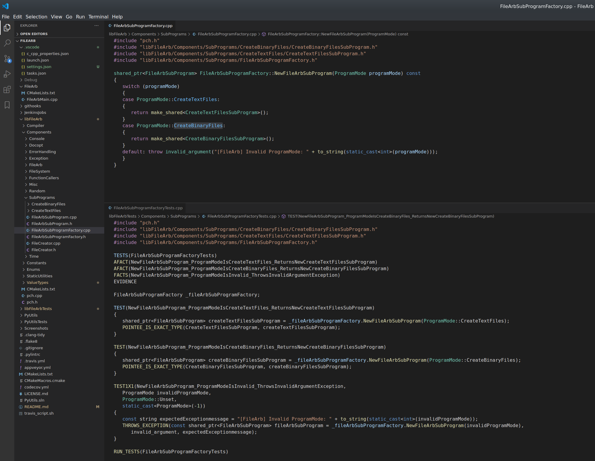
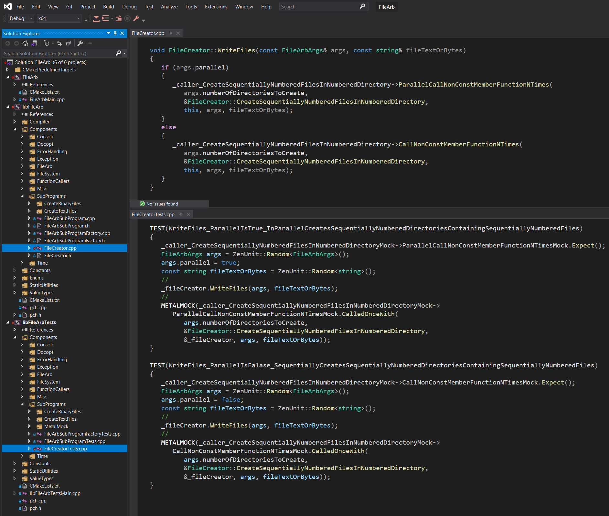
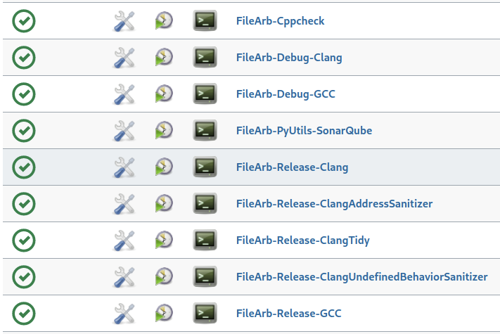
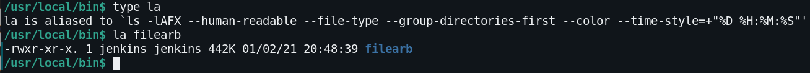
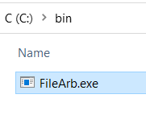

# 🗃️ FileArb 🗃️

[](https://en.wikipedia.org/wiki/C%2B%2B20)  

FileArb is a cross-platform C++ command line program for quickly creating in parallel an arbitrary number of text files or binary files containing arbitrary text or arbitrary bytes for the purpose of performance testing <a href="https://github.com/NeilJustice/FileRevisor">FileRevisor</a> or the speed of file creation in general.

|Build Type|Build Status|
|----------|------------|
|Travis CI Linux Clang 9.0.1 and Linux GCC 9.3.0 Debug and Release|[](https://travis-ci.com/NeilJustice/FileArb)|
|AppVeyor Windows Visual Studio 2019 x64 Debug and Release|<a href="https://ci.appveyor.com/project/NeilJustice/FileArb"></a>|
|Code Coverage for the Travis CI Linux GCC 9.3.0 Release build|[](https://codecov.io/gh/NeilJustice/FileArb)|

FileArb is rigorously unit tested with <a href="https://github.com/NeilJustice/ZenUnitAndMetalMock">ZenUnit and MetalMock</a>.

* [FileArb Command Line Usage](#filearb-command-line-usage)
* [FileArb Program Modes](#filearb-program-modes)
   * [create-text-files](#create-text-files)
   * [create-binary-files](#create-binary-files)
* [FileArb Code Structure As It Appears In Visual Studio Code](#filearb-code-structure-as-it-appears-in-visual-studio-code)
* [FileArb Code Structure As It Appears In Visual Studio 2019](#filearb-code-structure-as-it-appears-in-visual-studio-2019)
* [Linux Jenkins Jobs Which Build, clang-tidy, AddressSanitize and UndefinedBehaviorSanitize FileArb](#linux-jenkins-jobs-which-build-clang-tidy-addresssanitize-and-undefinedbehaviorsanitize-filearb)
* [Windows Jenkins Jobs Which Build FileArb On Windows With Visual Studio 2019](#windows-jenkins-jobs-which-build-filearb-on-windows-with-visual-studio-2019)
* [How To Build Binary filearb On Linux With Clang](#how-to-build-binary-filearb-on-linux-with-clang)
* [How To Build Executable FileArb.exe On Windows With Visual Studio 2019](#how-to-build-executable-filearbexe-on-windows-with-visual-studio-2019)
* [FileArb Roadmap](#filearb-roadmap)

## FileArb Command Line Usage

```
FileArb v0.9.1
Creates an arbitrary number of text files or binary files
containing an arbitrary number of lines, characters, or bytes.
Optional suffixes for --bytes=<BytesPerFile>: B, KB, MB, or GB
https://github.com/NeilJustice/FileArb

Usage:
   filearb create-text-files
      --target=<TargetDirectoryPath>
      --directories=<NumberOfDirectories>
      --files=<FilesPerDirectory>
      --lines=<LinesPerFile>
      --characters=<CharactersPerLine>
      [--parallel]
      [--verbose]
   filearb create-binary-file
      --target=<TargetDirectoryPath>
      --bytes=<NumberOfBytes>
      [--random-bytes]
   filearb create-binary-files
      --target=<TargetDirectoryPath>
      --directories=<NumberOfDirectories>
      --files=<NumberOfFiles>
      --bytes=<BytesPerFile>
      [--random-bytes]
      [--parallel]
      [--verbose]
```

FileArb command line arguments are parsed using the excellent single-header library [docopt.cpp](https://github.com/docopt/docopt.cpp):


## FileArb Program Modes

### create-text-files

FileArb program mode `create-text-files` creates at a specified directory a specified number of subdirectories containing a specified number of text files each containing '0' characters.


### create-binary-files

FileArb program mode `create-binary-files` creates at a specified `--target` directory a specified number of `--directories` each containing a specified number of `--files` each containing `--bytes` number of bytes, either 0 bytes or `[--random-bytes]`.


## FileArb Code Structure As It Appears in Visual Studio Code



## FileArb Code Structure As It Appears In Visual Studio 2019



## Linux Jenkins Jobs Which Build, clang-tidy, AddressSanitize and UndefinedBehaviorSanitize FileArb

A Jenkins Blue Ocean build pipeline builds the following FileArb Jenkins jobs on Fedora 33:



## Windows Jenkins Jobs Which Build FileArb On Windows With Visual Studio 2019

A Jenkins Blue Ocean build pipeline builds the following FileArb Jenkins jobs on Windows:


## How To Build Binary filearb On Linux With Clang

```bash
git clone https://github.com/NeilJustice/FileArb
cd FileArb && mkdir Release && cd Release
CXX=clang++ cmake .. -GNinja -DCMAKE_BUILD_TYPE=Release
# Builds then copies binary filearb to /usr/local/bin/filearb
sudo cmake --build . --target install
```

Resulting binary `/usr/local/bin/filearb`:



## How To Build Executable FileArb.exe On Windows With Visual Studio 2019

```powershell
git clone https://github.com/NeilJustice/FileArb
cd FileArb
cmake . -G"Visual Studio 16 2019" -A x64 -DCMAKE_INSTALL_PREFIX=C:\bin
# Builds then copies FileArb.exe to C:\bin\FileArb.exe
cmake --build . --config Release --target install
```

Resulting executable `C:\bin\FileArb.exe`:



## FileArb Roadmap

|Future FileArb Feature|Estimated Delivery Month|Implementation Status|
|----------------------|------------------------|---------------------|
|create-binary-files option [--random-bytes] which reads from `/dev/urandom` on Linux|January 2021|Implemented|
|Linux and Windows SonarQube static analysis Jenkins jobs for Cloudundancy|February 2021|In progress|
|GitHub Actions build|February 2021|Awaiting implementation|
|SonarCloud static analysis badge|February 2021|Awaiting implementation|
|Coverity static analysis badge|February 2021|Awaiting implementation|
|Automated acceptance testing for FileArb|May 2021|Awaiting implementation|
