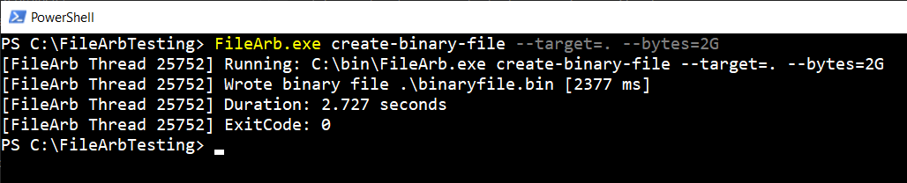

<p align="center"><br></p>

|Build Type|Build Status|
|----------|------------|
|Clang 18 and GCC 13 on ubuntu-latest|<a href="https://github.com/NeilJustice/FileArb/actions/workflows/linux_build.yml"></a>|
|VS2026 on windows-latest|<a href="https://github.com/NeilJustice/FileArb/actions/workflows/windows_build.yml"></a>|
|GCC lcov code coverage|<a href="https://codecov.io/gh/NeilJustice/FileArb"></a>|

FileArb is a C++23 command line program for quickly creating in parallel an arbitrary number of arbitrarily large text files or binary files.

Three use cases for FileArb:

1. Performance testing the write speed of storage hardware such as USB drives, NVMe drives, and network file shares.
2. Performance testing file-I/O-intensive programs such as <a href="https://github.com/NeilJustice/FileRevisor">FileRevisor</a> which perform many file operations such as text replacement.
3. Learning the true cost of cloud storage resources by way of creating, for example, 10 1-GB files on an Azure file share followed by examining the resulting Azure bill.

* [FileArb command line usage](#filearb-command-line-usage)
* [FileArb program modes](#filearb-program-modes)
   * [create-binary-file](#create-binary-file)
   * [create-binary-files](#create-binary-files)
   * [create-text-file](#create-text-file)
   * [create-text-files](#create-text-files)
* [Steps to build binary filearb on Linux with Clang](#steps-to-build-binary-filearb-on-linux-with-clang)
* [Steps to build executable FileArb.exe on Windows with Visual Studio 2026](#steps-to-build-executable-filearbexe-on-windows-with-visual-studio-2026)
* [Acknowledgements](#acknowledgements)

## FileArb command line usage

```ini
FileArb v1.1.0
Optional suffixes for --bytes arguments: b or B, k or K, m or M, and g or G.

Usage:
   filearb create-binary-file
      --target=<DirectoryPath>
      --bytes=<NumberOfBytes>
      [--random-bytes]
   filearb create-binary-files
      --target=<DirectoryPath>
      --directories=<NumberOfDirectories>
      --files=<NumberOfFiles>
      --bytes=<BytesPerFile>
      [--random-bytes]
      [--parallel]
      [--quiet]
   filearb create-text-file
      --target=<DirectoryPath>
      --lines=<LinesPerFile>
      --characters=<CharactersPerLine>
      [--random-letters]
   filearb create-text-files
      --target=<DirectoryPath>
      --directories=<NumberOfDirectories>
      --files=<FilesPerDirectory>
      --lines=<LinesPerFile>
      --characters=<CharactersPerLine>
      [--random-letters]
      [--parallel]
      [--quiet]
```

## FileArb program modes

### create-binary-file

```ini
filearb create-binary-file
   --target=<DirectoryPath>
   --bytes=<NumberOfBytes>
   [--random-bytes]
```

`create-binary-file` creates in a specified `--target` directory a file named `binaryfile.bin` containing `--bytes` number of binary 0 bytes.

Console output for `filearb create-binary-file --target=. --bytes=2G` on Linux:


Console output for `FileArb.exe create-binary-file --target=. --bytes=2G` on Windows:




`--random-bytes` can be specified to create a binary file containing pseudorandom bytes sampled from `std::random_device`.

Here are the contents of one potential random binary file after running `filearb create-binary-file --target=C:\FileArbTesting --bytes=64 --random-bytes`:


### create-binary-files

```ini
filearb create-binary-files
   --target=<DirectoryPath>
   --directories=<NumberOfDirectories>
   --files=<NumberOfFiles>
   --bytes=<BytesPerFile>
   [--random-bytes]
   [--parallel]
   [--quiet]
```

`create-binary-files` creates in a specified `--target` directory a specified number of `--directories` each containing a specified number of `--files` each containing `--bytes` number of 0 bytes or `[--random-bytes]`.

Console output for `filearb create-binary-files --target=. --directories=5 --files=3 --bytes=1024 --random-bytes --parallel` on Linux:


### create-text-file

```ini
filearb create-text-file
   --target=<DirectoryPath>
   --lines=<LinesPerFile>
   --characters=<CharactersPerLine>
   [--random-letters]
```

`create-text-file` creates a text file in a specified `--target` directory containing `--lines` number of lines each containing `--characters` number of `0` ASCII characters per line or random capital letters if `--random-letters` is specified.

Console output for `filearb create-text-file --target=. --lines=5 --characters=10` on Linux:


### create-text-files

```ini
filearb create-text-files
   --target=<DirectoryPath>
   --directories=<NumberOfDirectories>
   --files=<FilesPerDirectory>
   --lines=<LinesPerFile>
   --characters=<CharactersPerLine>
   [--random-letters]
   [--parallel]
   [--quiet]
```

`filearb create-text-files` creates at a specified `--target` directory a specified number of `--directories` each containing a specified number of `--files` containing `0` ASCII characters or `--random-letters`.

Console output for `filearb create-text-files --target=target_dir --directories=5 --files=3 --lines=3 --characters=64 --random-letters --parallel` on Linux:


## Steps to build binary filearb on Linux with Clang

```bash
git clone https://github.com/NeilJustice/FileArb
cd FileArb && mkdir Release && cd Release
CXX=clang++ cmake .. -GNinja -DCMAKE_BUILD_TYPE=RelWithDebInfo
sudo cmake --build . --target install
```

## Steps to build executable FileArb.exe on Windows with Visual Studio 2026

```powershell
git clone https://github.com/NeilJustice/FileArb
cd FileArb
cmake . -G"Visual Studio 18 2026" -A x64 -DCMAKE_INSTALL_PREFIX="C:\bin"
cmake --build . --config RelWithDebInfo --target install
```

## Acknowledgements

<a href="https://brandmark.io">brandmark.io</a> for FileArb's logo
