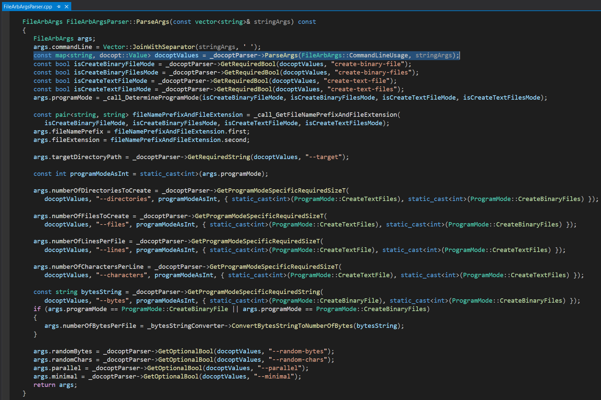

# 🗃️ FileArb 🗃️

[](https://en.wikipedia.org/wiki/C%2B%2B20)  

FileArb is a cross-platform C++ command line program for quickly creating in parallel an arbitrary number of text files or binary files containing an arbitrary number of lines, characters, or bytes.

FileArb can be used to performance test file write speeds across various storage hardware types such as NVMe drives vs. USB drives, across various file system settings such as cluster sizes and RAID settings, and for performance testing programs that process large numbers of files, such as <a href="https://github.com/NeilJustice/FileRevisor">FileRevisor</a>.

|Build Type|Build Status|
|----------|------------|
|Travis CI Linux Clang 9.0.1 and Linux GCC 9.3.0 Debug and Release|[](https://travis-ci.com/NeilJustice/FileArb)|
|AppVeyor Windows Visual Studio 2019 x64 Debug and Release|<a href="https://ci.appveyor.com/project/NeilJustice/FileArb"></a>|
|Code Coverage for the Travis CI Linux GCC 9.3.0 Release build|[](https://codecov.io/gh/NeilJustice/FileArb)|

FileArb is rigorously unit tested with <a href="https://github.com/NeilJustice/ZenUnitAndMetalMock">ZenUnit and MetalMock</a>.

* [FileArb Command Line Usage](#filearb-command-line-usage)
* [FileArb Program Modes](#filearb-program-modes)
   * [create-binary-file](#create-binary-file)
   * [create-binary-files](#create-binary-files)
   * [create-text-file](#create-text-file)
   * [create-text-files](#create-text-files)
* [FileArb Code Structure As It Appears In Visual Studio Code On Linux](#filearb-code-structure-as-it-appears-in-visual-studio-code-on-linux)
* [FileArb Code Structure As It Appears In Visual Studio 2019 On Windows](#filearb-code-structure-as-it-appears-in-visual-studio-2019-on-windows)
* [Linux Jenkins Jobs Which Build, Cppcheck, clang-tidy, AddressSanitize, UndefinedBehaviorSanitize, and ThreadSanitize FileArb](#linux-jenkins-jobs-which-build-cppcheck-clang-tidy-addresssanitize-undefinedbehaviorsanitize-and-threadsanitize-filearb)
* [Windows Jenkins Jobs Which Build and Cppcheck FileArb](#windows-jenkins-jobs-which-build-and-cppcheck-filearb)
* [How To Build Binary filearb On Linux With Clang](#how-to-build-binary-filearb-on-linux-with-clang)
* [How To Build Executable FileArb.exe On Windows With Visual Studio 2019](#how-to-build-executable-filearbexe-on-windows-with-visual-studio-2019)
* [FileArb Roadmap](#filearb-roadmap)

## FileArb Command Line Usage

```
FileArb v0.10.0
Creates an arbitrary number of text files or binary files
containing an arbitrary number of lines, characters, or bytes.
Optional suffixes for --bytes=<BytesPerFile> argument:
b or B, kb or KB, mb or MB, gb or GB.
https://github.com/NeilJustice/FileArb

Usage:
   filearb create-binary-file
      --target=<TargetDirectoryPath>
      --bytes=<NumberOfBytes>
      [--random-bytes]
   filearb create-binary-files
      --target=<TargetDirectoryPath>
      --directories=<NumberOfDirectories>
      --files=<NumberOfFiles>
      --bytes=<BytesPerFile>
      [--random-bytes]
      [--parallel]
      [--minimal]
   filearb create-text-file
      --target=<TargetDirectoryPath>
      --lines=<LinesPerFile>
      --characters=<CharactersPerLine>
      [--random-letters]
   filearb create-text-files
      --target=<TargetDirectoryPath>
      --directories=<NumberOfDirectories>
      --files=<FilesPerDirectory>
      --lines=<LinesPerFile>
      --characters=<CharactersPerLine>
      [--random-letters]
      [--parallel]
      [--minimal]
```

FileArb command line arguments are parsed using the excellent single-header library [docopt.cpp](https://github.com/docopt/docopt.cpp):



## FileArb Program Modes

### create-binary-file

```
filearb create-binary-file
      --target=<TargetDirectoryPath>
      --bytes=<NumberOfBytes>
      [--random-bytes]
```

FileArb program mode `create-binary-file` creates at a specified `--target` directory a file named `binaryfile.bin` containing `--bytes` number of binary 0 bytes.

`create-binary-file` example on Windows:


`--random-bytes` can be speecified to create a binary file containing random bytes sampled from `std::random_device`.

Resulting binary file from running `filearb create-binary-file --target=C:\FileArbTesting --bytes=64 --random-bytes`:


### create-text-file

```
filearb create-text-file
   --target=<TargetDirectoryPath>
   --lines=<LinesPerFile>
   --characters=<CharactersPerLine>
   [--random-letters]
```

FileArb program mode `create-text-file` creates at a specified `--target` directory a file containing `--lines` number of lines each containing `--characters` number of '0' characters per line.

### create-binary-files

```
filearb create-binary-files
      --target=<TargetDirectoryPath>
      --directories=<NumberOfDirectories>
      --files=<NumberOfFiles>
      --bytes=<BytesPerFile>
      [--random-bytes]
      [--parallel]
      [--minimal]
```

FileArb program mode `create-binary-files` creates at a specified `--target` directory a specified number of `--directories` each containing a specified number of `--files` each containing `--bytes` number of bytes, either 0 bytes or `[--random-bytes]`.


### create-text-files

FileArb program mode `create-text-files` creates at a specified directory a specified number of subdirectories containing a specified number of text files each containing '0' characters.


## FileArb Code Structure As It Appears in Visual Studio Code On Linux


## FileArb Code Structure As It Appears In Visual Studio 2019 On Windows


## Linux Jenkins Jobs Which Build, Cppcheck, clang-tidy, AddressSanitize, UndefinedBehaviorSanitize, and ThreadSanitize FileArb

A Jenkins Blue Ocean build pipeline builds the following FileArb Jenkins jobs on Fedora 33 with Clang 11.0.0 and GCC 10.2.1:


## Windows Jenkins Jobs Which Build and Cppcheck FileArb

A Jenkins Blue Ocean build pipeline builds the following FileArb Jenkins jobs on Windows 10 with Visual Studio 2019:


## How To Build Binary filearb On Linux With Clang

```bash
git clone https://github.com/NeilJustice/FileArb
cd FileArb && mkdir Release && cd Release
CXX=clang++ cmake .. -GNinja -DCMAKE_BUILD_TYPE=Release
sudo cmake --build . --target install
```

Resulting binary `/usr/local/bin/filearb`:


## How To Build Executable FileArb.exe On Windows With Visual Studio 2019

```powershell
git clone https://github.com/NeilJustice/FileArb
cd FileArb
cmake . -G"Visual Studio 16 2019" -A x64 -DCMAKE_INSTALL_PREFIX=C:\bin
cmake --build . --config Release --target install
```

Resulting executable `C:\bin\FileArb.exe`:


## FileArb Roadmap

|Future FileArb Feature|Implementation Status As Of 3/15/2021|
|----------------------|------------------------------------|
|GitHub Actions build|Awaiting implementation|
|SonarCloud Python badge for FileArbPyUtils|Awaiting implementation|
|SonarCloud C++ badge|Awaiting implementation|
|Coverity C++ static analysis badge|Awaiting implementation|
|Automated acceptance testing|Awaiting implementation|
